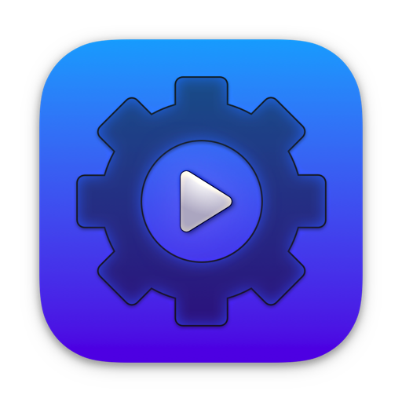
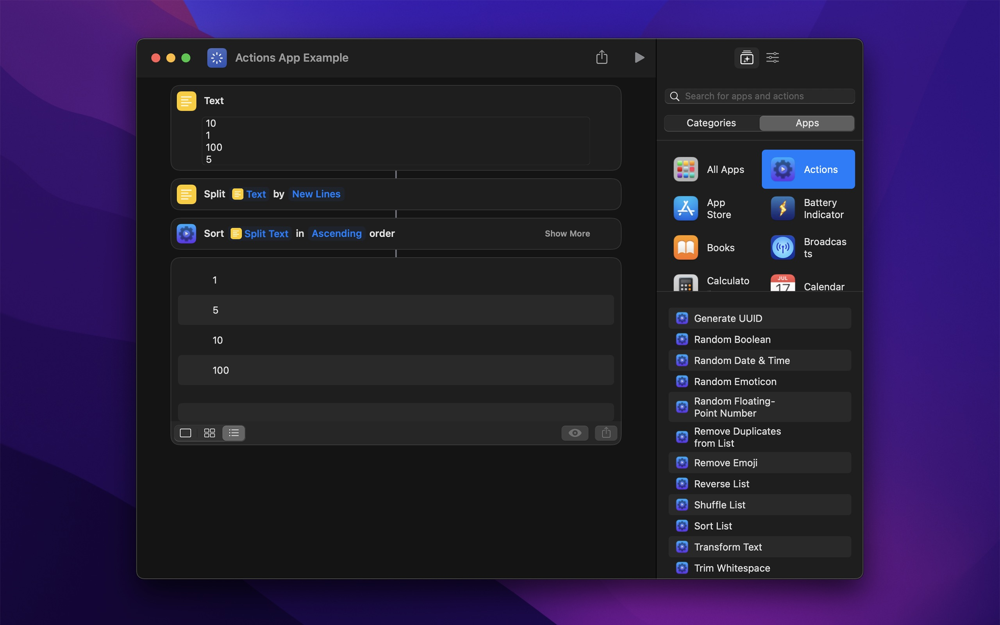

	 
	
	<h1>Actions</h1>
	

		<b>Additional actions for the Shortcuts app</b>
	

	 
	 
	 

The app provides lots of powerful extra actions for the Shortcuts app on macOS and iOS. These actions make it significantly easier to create shortcuts.

[**Submit action idea**](https://github.com/sindresorhus/Actions/issues/new/choose)\
*(Submit an issue before [submitting a pull request](.github/contributing.md))*

---

Want to run shortcuts directly from the iOS Lock Screen? Check out my [Quick Launch](https://sindresorhus.com/quick-launch) app.

And trigger shortcuts on your Mac from your iOS device with my [Hyperduck](https://sindresorhus.com/hyperduck#shortcuts) app.

And for high-quality transcription, see my [Aiko](https://sindresorhus.com/aiko) app.

---

## Download

*Requires at least macOS 13 or iOS 16*

**Older versions (macOS)**

- [1.13.1](https://github.com/sindresorhus/Actions/releases/download/v1.13.1/Actions.1.13.1.-.macOS.12.zip) for macOS 12+

## Included actions

- Add to List
- Apply Capture Date
- Ask for Text with Timeout
- Authenticate
- Blur Images
- Boolean
- Calculate with Soulver
- Choose from List (Extended)
- Clamp Number
- Color
- Combine Lists
- Combine Videos
- Convert Coordinates to Location
- Convert Date to Unix Time
- Convert Location to Geo URI
- Convert Unix Time to Date
- Create Color Image
- Create Menu Item
- Create URL
- Edit URL
- Filter List
- Flash Screen (macOS-only)
- Format Currency
- Format Date Difference
- Format Duration
- Format Number — Compact
- Format Person Name
- Generate CSV
- Generate Haptic Feedback (iOS-only)
- Generate Random Data
- Generate Random Text
- Generate UUID
- Get Audio Playback Destination (iOS-only)
- Get Average Color
- Get Average Color of Image
- Get Battery State
- Get Boolean from Input
- Get Default Printer (macOS-only)
- Get Device Details (Extended)
- Get Device Orientation
- Get Dominant Colors of Image
- Get Emojis
- Get File Icon (macOS-only)
- Get File Path
- Get High-Resolution Timestamp
- Get Image Location
- Get Index of List Item
- Get Map Image of Location
- Get Modifier Key State (macOS-only)
- Get Music Playlists (iOS-only)
- Get Printers (macOS-only)
- Get Query Item Value from URL
- Get Query Items from URL
- Get Query Items from URL as Dictionary
- Get Random Boolean
- Get Random Color
- Get Random Date and Time
- Get Random Emoticon
- Get Random Floating-Point Number
- Get Random Number from Seed
- Get Related Words
- Get Running Apps (macOS-only)
- Get SF Symbol Image
- Get Title of URL
- Get Uniform Type Identifier
- Get Unsplash Image
- Get User Details
- Global Variable
- Hex Encode
- Hide Shortcuts App
- Invert Images
- Is Accessibility Feature On
- Is Audio Playing (iOS-only)
- Is Bluetooth On
- Is Cellular Data On
- Is Cellular Low Data Mode On
- Is Connected to VPN (iOS-only)
- Is Dark Mode On
- Is Day
- Is Device Locked
- Is Device Orientation
- Is Host Reachable
- Is Low Power Mode On
- Is Online
- Is Screen Locked (macOS-only)
- Is Shaking Device
- Is Silent Mode On (iOS-only)
- Is Web Server Reachable
- Is Wi-Fi On (macOS-only)
- Merge Dictionaries
- Open URLs with App (macOS-only)
- Overwrite File
- Parse CSV
- Parse JSON5
- Play Alert Sound (macOS-only)
- Pretty Print Dictionaries
- Remove Duplicate Lines
- Remove Duplicates from List
- Remove Emojis
- Remove Empty Lines
- Remove from List
- Remove Non-Printable Characters
- Reverse Lines
- Reverse List
- Round Number to Multiple
- Sample Color from Screen (macOS-only)
- Scan Documents (iOS-only)
- Scan QR Codes in Image
- Set Creation and Modification Date of File
- Set Default Printer (macOS-only)
- Set Image Location
- Set Uniform Type Identifier
- Shuffle List
- Sort List
- Spell Out Number
- Transcribe Audio
- Transform Lists
- Transform Text *(camel case, slugify, transliteration, etc.)*
- Transform Text with JavaScript
- Trim Whitespace
- Truncate List
- Truncate Number
- Truncate Text
- Wait Milliseconds
- Write or Edit Text

#### Want more shortcut actions?

- Use the ChatGPT API → [AI Actions](https://sindresorhus.com/ai-actions)
- High-quality transcription (speech to text) in 100 languages → [Aiko](https://sindresorhus.com/aiko)
- Trigger shortcuts on your Mac from your iOS device → [Hyperduck](https://sindresorhus.com/hyperduck#shortcuts)
- Show text in menu bar → [One Thing](https://sindresorhus.com/one-thing)
- Open URLs in a specific browser → [Velja](https://sindresorhus.com/velja)
- Remove tracking parameters from URLs → [Velja](https://sindresorhus.com/velja)
- Generate images from text with AI → [Amazing AI](https://sindresorhus.com/amazing-ai)
- Clear clipboard formatting → [Pure Paste](https://sindresorhus.com/pure-paste)
- Get internet speed → [Speediness](https://sindresorhus.com/speediness)
- Join video calls → [Dato](https://sindresorhus.com/dato)
- Put text on the iOS Lock Screen → [Any Text](https://sindresorhus.com/any-text)
- Get random animated GIF → [Jiffy](https://sindresorhus.com/jiffy)

## Screenshot

### Non-App Store version for macOS

A special version for users that cannot access the App Store. It won't receive automatic updates. I will update it here once a year.

[Download](https://dsc.cloud/sindresorhus/Actions-2.3.1-1678525767.zip) *(2.3.1 · macOS 13+)*

## FAQ

#### The actions don't show up in the Shortcuts app

Restart your device.

#### Why is this free without ads?

I just enjoy making apps. I earn money on other apps. Consider leaving a nice review on the App Store.

#### Can I contribute localizations?

I don't have any immediate plans to localize the app.

## Other apps

- [Gifski](https://github.com/sindresorhus/Gifski) - Convert videos to high-quality GIFs
- [System Color Picker](https://github.com/sindresorhus/System-Color-Picker) - The macOS color picker as an app with more features
- [Plash](https://github.com/sindresorhus/Plash) - Make any website your Mac desktop wallpaper
- [Dato](https://sindresorhus.com/dato) - Better menu bar clock with calendar and time zones
- [More apps…](https://sindresorhus.com/apps)
